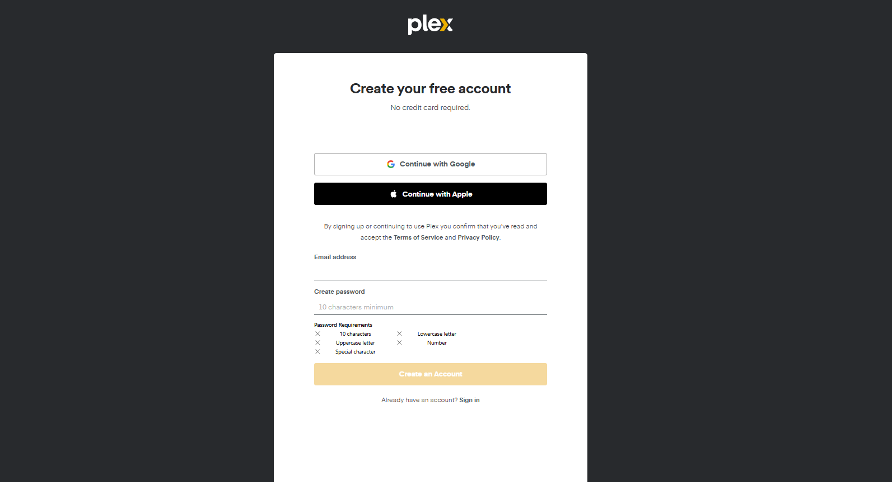

Plex.tv/Link
===============

Easily activate Plex on Smart TVs, Roku, Firestick, and other devices using Plex.tv/Link. Enter the activation code and start streaming your favorite media effortlessly.

Plex is a powerful media streaming platform that allows you to organize and stream your personal media collection on various devices. To start streaming, you need to activate Plex on your device using Plex.tv/link. Follow this guide for a quick setup.

How to Activate Plex via Plex.tv/Link
======================================

Step 1: Install the Plex App
~~~~~~~~~~~~~~~~~~~~~~~~~~~~~

1. Open the app store on your device.
2. Search for Plex and install the app.
3. Launch the app and sign in to your Plex account.

Step 2: Get the Activation Code
~~~~~~~~~~~~~~~~~~~~~~~~~~~~~~~~~

1. Open the Plex app on your device.
2. Select Sign In to display a unique activation code on the screen.

Step 3: Link Your Device at Plex.tv/Link
~~~~~~~~~~~~~~~~~~~~~~~~~~~~~~~~~~~~~~~~~

1. Open a browser on your phone or PC.
2. Go to **Plex.tv/link**.
3. Log in with your Plex account.
4. Enter the activation code displayed on your device.
5. Click Submit to complete activation.
